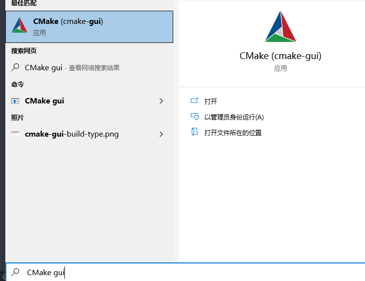
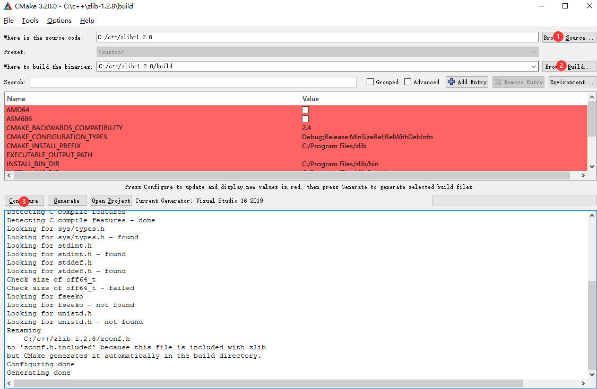
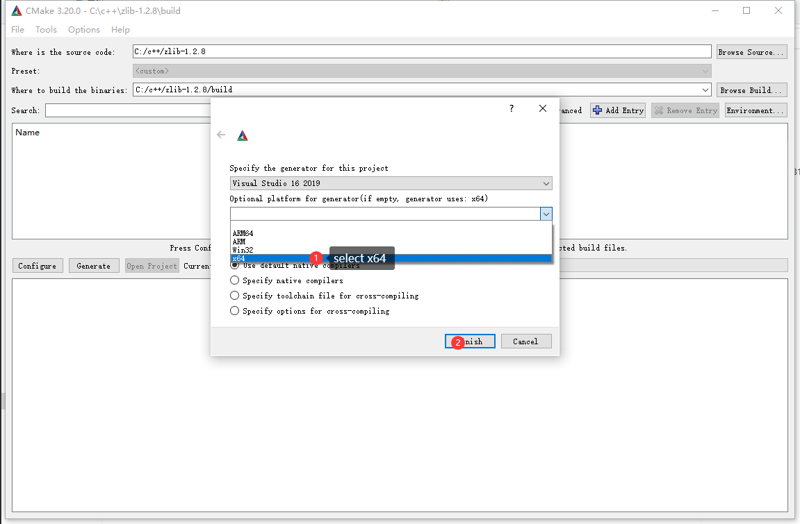
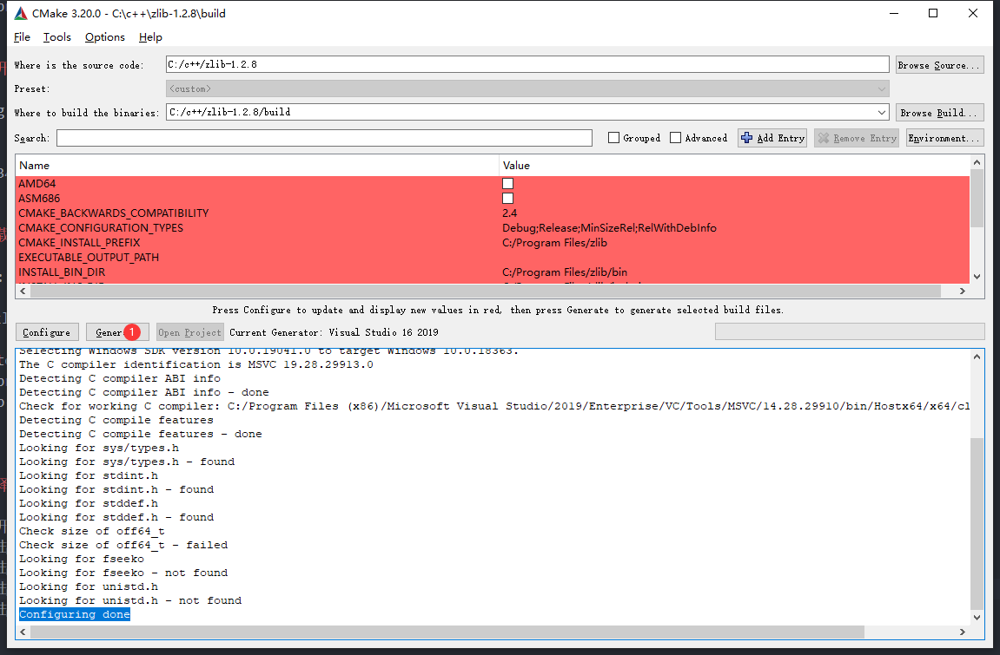
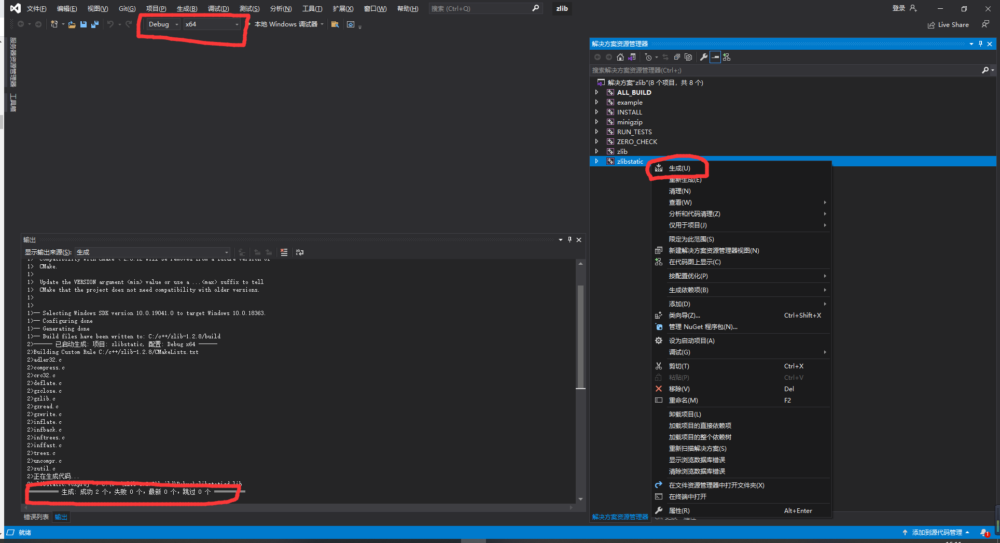
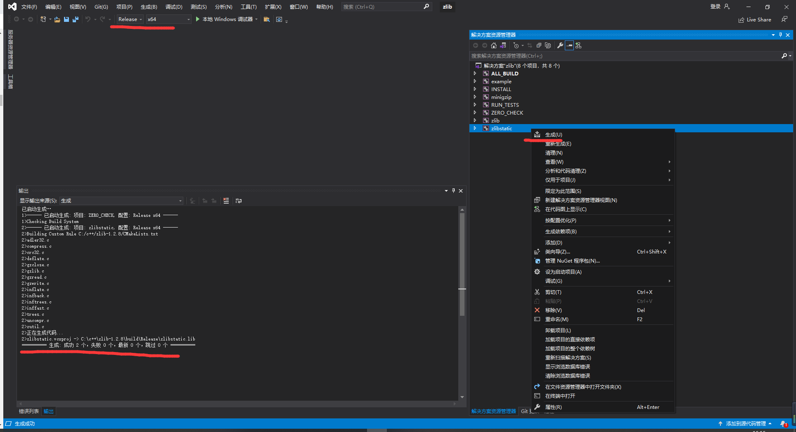
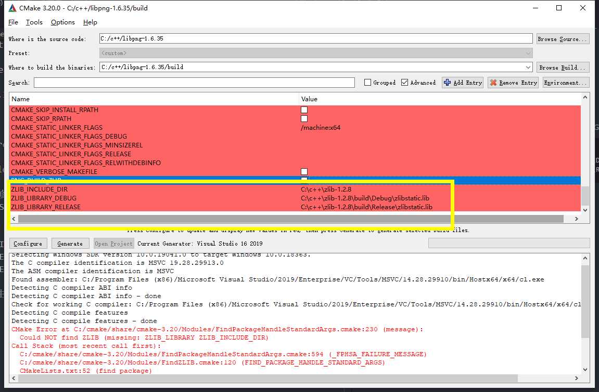

# 二进制程序编译 exe程序，CMake minGW练习

## 工具准备 

CMake: https://cmake.org/

Visual Studio 2019: https://visualstudio.microsoft.com/zh-hans/

## 下载 libpng-1.6.35 源码    Download the libpng-1.6.35 source code

libpng: https://github.com/glennrp/libpng/releases/tag/v1.6.35

解压 libpng-1.6.35.tar.gz

```
directory
|-libpng-1.6.35

```
## 打开 zlib.props  文件，查看依赖zlib的版本

libpng > projects -> vstudio ->  zlib.props 

```
line 34  <ZLibSrcDir>..\..\..\..\zlib-1.2.8</ZLibSrcDir>
```

## 下载 zlib-1.2.8 源码  Download the zlib-1.2.8 source code

zlib : https://github.com/madler/zlib/releases/tag/v1.2.8

解压 zlib-1.2.8.tar.gz
```
directory
|-libpng-1.6.35
|-zlib-1.2.8

```

## 编译 zlib-1.2.8

1. 打开 CMake gui


2. 点击 Browse Source 选择 zlib-1.2.8 

3. 点击 Browse Build 选择 zlib-1.2.8/build 目录

4. 点击 Configure(生成CMake Cahce) 选择 Visual Studio 
2019 和 x64点击 Finish 等待输出消息  Configuring done

5. 点击 Generate(生成Visual Studio的*.sln)  等待输出消息 Generating  done

6. 点击 Open Project，会在 Visual Studio 
2019 中打开

7. 生成debug版的静态链接库。
   
    (1). 确认解决方案为debug、X64平台。
    
    (2). 在zlibstatic项目上右击–>生成  等待 输出窗口提示生成成功 (2个)

    (3). zlib的debug、X64版的静态链接库已经编译成功。
    

8. 生成release版的静态链接库。

    (1). 确认解决方案为release、X64平台。

    (2). 在zlibstatic项目上右击–>生成  等待 输出窗口提示生成成功 (2个)

    (3). zlib的release、X64版的静态链接库已经编译成功。
    

9. `最重要的一步 复制  zlib-1.2.8/build/zconf.h 文件到 zlib-1.2.8/`

## 编译 libpng-1.6.35

1. 打开 CMake gui

2. 点击 Browse Source 选择 zlib-1.2.8 

3. 点击 Browse Build 选择 zlib-1.2.8/build 目录

4. 勾选 Advanced, 修改 ZLIB_INCLUDE_DIR,ZLIB_LIBRARY_DEBUG、ZLIB_LIBRARY_RELEASE 后点击 Configure

    ```
    ZLIB_INCLUDE_DIR       C:\c++\zlib-1.2.8
    ZLIB_LIBRARY_DEBUG     C:\c++\zlib-1.2.8\build\Debug\zlibstatic.lib
    ZLIB_LIBRARY_RELEASE   C:\c++\zlib-1.2.8\build\Release\zlibstatic.lib
    ```
    
5. 单击 Generate，生成Visual Studio 2019的*.sln项目。
6. 点击 Open Project，会在 Visual Studio 2019 中打开

7. 在Visual Studio 2019中分别以Debug和Release方式编译`png_static`项目。


## 编译 mozjpeg-4.0.3

 没有前置依赖  按上面的流程即可

## 我想用 minGW 怎么编译？

1. 在 CMake gui 中，点击 Configure ，选择 “MinGW Makefile” 等待  Configuring done
2. 点击 Generate 等待  Generate done
3. 打开 cmd,执行命令 `cd  C:\c++\zlib-1.2.8\build\`
4. 执行 minGW32-make (每个安装的minGW make命令可能不一样 自行选择即可)


## 编译出来的 exe我单独复制出来不能怎么回事？

因为 应用程序 需要依赖 某个dll，将这个dll 放在和exe程序同一位置即可
